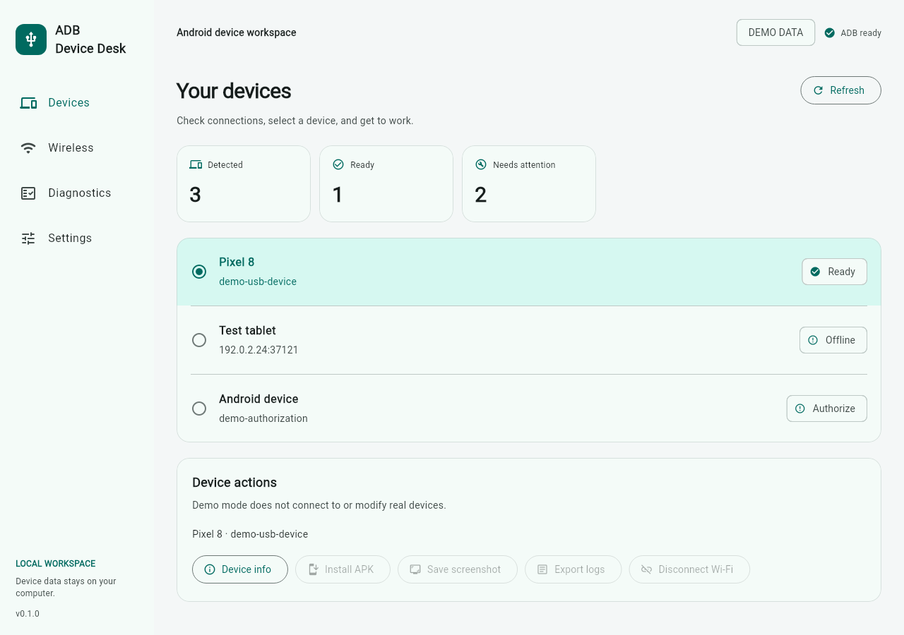

# ADB Device Desk

Connect Android devices, check why ADB is failing, and save screenshots or logs from a desktop app.

连接安卓设备，排查 ADB 连接问题，在电脑上安装 APK、截图和导出日志。

**Status:** v0.1.0 development preview. A Windows x64 package has passed CI build and startup checks. Check [Releases](https://github.com/TolkmisLK/adb-device-desk/releases) for published downloads and the [validation record](docs/VALIDATION.md) for device and package checks.

**状态：** v0.1.0 开发预览。Windows x64 程序包已通过 CI 构建与启动检查。公开下载请查看 [Releases](https://github.com/TolkmisLK/adb-device-desk/releases)，设备和程序包的验证范围见[验证记录](docs/VALIDATION.md)。

[中文准备与运行](#使用前准备) · [English setup](#english) · [Validation record / 验证记录](docs/VALIDATION.md)



Actual Flutter rendering with demo data; not a Windows or physical-device acceptance screenshot. [Dark theme](docs/screenshots/devices-dark.png) · [Wireless](docs/screenshots/wireless.png) · [Diagnostics](docs/screenshots/diagnostics.png)

## 中文

### 能做什么

- 查看 ADB 设备列表，区分已连接、离线、待授权和特殊启动状态。
- 按步骤完成 Android 11+ 无线配对与连接，分别填写配对端口和连接端口。
- 检查本机 ADB、设备状态和一个指定 TCP 端口，给出下一步建议。
- 对所选设备安装 APK、保存 PNG 截图、查看基本信息、导出最近 500 行 logcat。
- 选择同一个 APK 并明确勾选多台已连接设备，依次安装并查看每台设备的结果；单台失败后继续处理后续设备。
- 导出不含设备标识、网络地址或原始输出的 JSON 诊断报告。
- 中文/英文界面，跟随系统深浅主题，本机运行，无遥测。

### 使用前准备

1. 从 [Android 官方页面](https://developer.android.com/tools/releases/platform-tools)下载 Platform-Tools 并解压。
2. 在应用「设置」中选择 `adb.exe`，点击「验证并保存」。如果已将 ADB 加入 PATH，保留 `adb` 即可。
3. USB 连接：开启设备的开发者选项与 USB 调试，使用数据线连接，在设备上接受授权。
4. 无线连接：打开「无线连接」，按页面上的配对、连接两个步骤操作。

ADB 不随本项目分发。应用不要求 Android Studio；从源码编译桌面应用才需要 Flutter 与 Visual Studio。可用下载包以 [Releases](https://github.com/TolkmisLK/adb-device-desk/releases) 页面为准，旧草稿不作为下载入口。

### 从源码运行（Windows）

安装 Flutter **3.35.7**，以及 Visual Studio 2022 的 **Desktop development with C++** 工作负载。先运行 `flutter doctor -v` 确认 Windows 工具链。

```powershell
flutter pub get --enforce-lockfile
flutter run -d windows
```

不连接真实设备的演示模式：

```powershell
flutter run -d windows --dart-define=DEMO=true
```

演示模式标有「演示数据」，配对、连接、安装和真实设备导出操作均禁用。

### 检查与打包

```powershell
dart format --output=none --set-exit-if-changed lib test tool
flutter analyze --fatal-infos
flutter test
./tool/build-windows.ps1
```

产物为 `dist/adb-device-desk-0.1.0-windows-x64.zip`，包含可执行文件、Flutter DLL、数据文件和本地 C++ 运行库。必须整体解压，不能只复制 `.exe`。

### 已知边界

- 首版支持 Windows x64。Linux runner 仅用于开发；没有 macOS、手机端或浏览器发行版。
- TCP 端口可连接不等于 ADB 已连接、已配对或已授权。检查不会直接断言防火墙或路由是故障原因。
- 网络诊断只检查用户填写的一个地址，不自动扫描局域网；IPv6 使用 `[地址]:端口`。
- 无线连接需设备事先开启调试。应用不自动执行 `adb tcpip`、`adb kill-server` 或重置授权。
- ADB 自行发现的 mDNS 设备可显示和操作；首版的断开按钮仅适用于显式 `host:port` 连接。
- 每次安装仅支持一个 APK 文件，不支持 split APK / APKS / XAPK。批量安装对每台设备分别运行一次安装命令，单台命令最多等待 3 分钟。
- 不包含投屏、远程公网控制、其他批量操作或自动重连。
- 诊断报告仅包含结构化检查结果；**原始 logcat 不自动脱敏**，导出前会提示，分享前需要自行检查。

## English

ADB Device Desk is a local desktop interface for Android Debug Bridge. It helps developers and testers inspect connected devices, distinguish pairing from connection, and collect evidence when something fails.

Download [Google's Platform-Tools](https://developer.android.com/tools/releases/platform-tools), then select its `adb.exe` in Settings and verify it. Connect via USB or follow the separate wireless pairing and connection steps. Every device operation targets the selected serial explicitly. No background LAN scanning, telemetry, or automatic debugging-mode changes are included.

Build with Flutter **3.35.7** and the Visual Studio 2022 **Desktop development with C++** workload:

```powershell
flutter pub get --enforce-lockfile
flutter analyze --fatal-infos
flutter test
flutter run -d windows
./tool/build-windows.ps1
```

Use `--dart-define=DEMO=true` for a clearly marked, device-free demo. Windows x64 is the initial target. An open TCP port is not proof of ADB service identity or authorization. To install on several ready devices, choose **Batch install APK**, check each target, choose one APK and confirm; results appear per device. Installs run sequentially with a three-minute timeout for each device. Split packages, screen mirroring, other batch actions and automatic reconnection are outside v0.1.

Diagnostic JSON uses a field whitelist and omits addresses, serials, file paths, pairing codes and raw logs. Exported logcat is intentionally raw and requires user review before sharing. ADB is installed separately from Google's official distribution.

## Project documents

- [Roadmap and acceptance criteria / 路线与验收](docs/ROADMAP.md)
- [Troubleshooting / 故障排查](docs/TROUBLESHOOTING.md)
- [Architecture / 架构](docs/ARCHITECTURE.md)
- [Windows release checklist / Windows 发布检查](docs/RELEASING.md)
- [Validation record / 验证记录](docs/VALIDATION.md)
- [Security and data handling](SECURITY.md)

## License

MIT. Flutter, Dart and third-party packages retain their respective licenses. Android Debug Bridge is a separate tool; this project is not affiliated with Google or the Android project.
