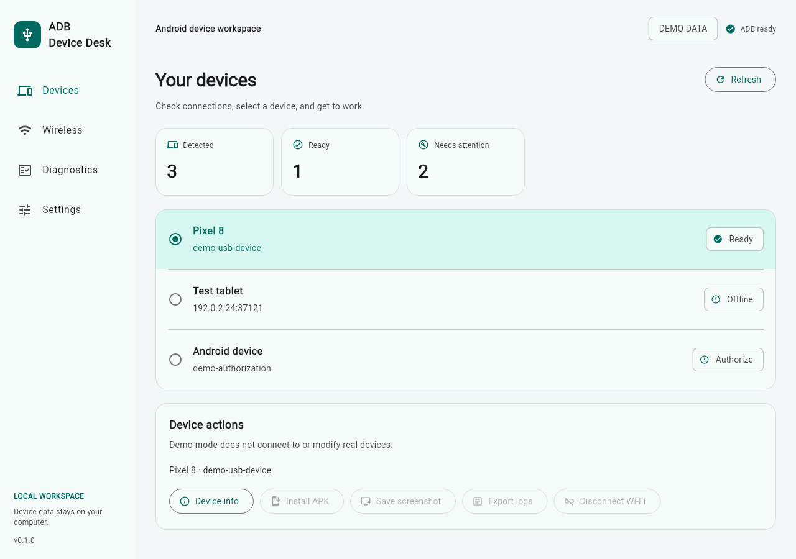

# 机伴（ADB Device Desk）中文使用指南

当前公开下载是 Windows x64 的 [v0.1.0-preview.3 预览版](https://github.com/TolkmisLK/adb-device-desk/releases/tag/v0.1.0-preview.3)。这是便携程序，适合在电脑上查看和操作已授权的 Android 设备。它不是手机应用，也不是正式稳定版。界面可切换中文和英文；本指南说明下载、首次连接、安装 APK 和导出证据的完整流程。

上图是实际 Flutter 测试渲染的**演示数据**，不是 Windows 真机验收截图。另见[无线连接页](screenshots/wireless.png)、[诊断页](screenshots/diagnostics.png)和[深色主题](screenshots/devices-dark.png)。

## 1. 下载并启动

1. 打开 [preview.3 发布页](https://github.com/TolkmisLK/adb-device-desk/releases/tag/v0.1.0-preview.3)，下载 `adb-device-desk-0.1.0-windows-x64.zip`。如需校验下载完整性，同时下载同名 `.zip.sha256` 文件；按该文件中的 SHA-256 值核对 ZIP。文件名中的 `0.1.0` 是应用基础版本，发布标签中的 `preview.3` 是预览批次。
2. 把 ZIP **完整解压**到一个目录，保留 `.exe`、DLL、`data` 文件夹和其他随包文件。不要只复制 `adb_device_desk.exe`。运行该可执行文件；便携包未签名，请确认来源是本项目发布页。
3. 另从 [Android 官方 Platform-Tools 页面](https://developer.android.com/tools/releases/platform-tools)下载并解压 Windows 版工具。机伴不附带 ADB，也无需安装完整 Android Studio。
4. 打开机伴「设置」，选择 Platform-Tools 文件夹中的 `adb.exe`，点击「验证并保存」。若已经把 ADB 加入系统 `PATH`，可保留默认的 `adb` 并验证。

如果程序打不开，先确认电脑是 Windows x64、ZIP 已完整解压，以及 DLL 和 `data` 与程序放在一起。若程序能打开却提示 ADB 不可用，检查选择的是可运行的 `adb.exe` 文件，而非文件夹；可在「设置」重新验证。

## 2. 连接与选择设备

### USB

在手机或平板开启「开发者选项」和「USB 调试」，用支持数据传输的 USB 线连接电脑。解锁设备，在设备上接受 USB 调试授权提示，再到机伴设备页刷新列表。显示为已连接、可操作的设备才能安装 APK 或导出内容。若显示 `unauthorized`，检查设备屏幕上的授权弹窗；若显示 `offline`，检查线缆、设备状态并刷新。Windows 如未识别设备，还可检查设备厂商 USB 驱动。

### Android 11+ 无线调试

手机与电脑应能在局域网内互通，手机先开启「开发者选项 → 无线调试」。在机伴「无线连接」页按顺序操作：

1. 手机上点「使用配对码配对设备」。把**这个弹窗**显示的 `IP:配对端口` 和六位配对码填入机伴配对区，点击「配对」。配对码可能过期，失败时重新打开弹窗取新码。
2. 回到手机的「无线调试」**主页面**，找到「IP 地址和端口」。把这里的 `IP:连接端口` 填入机伴连接区，点击「连接」，然后刷新设备列表。
3. 配对端口与连接端口通常不同，不能互换；重新开启无线调试后端口也可能变化。机伴的「发现无线服务」只读取 ADB 报出的地址，选择「使用地址」只是填入对应输入框，仍需核对手机显示的地址，并明确点击配对或连接。发现列表为空时可手动填写。

对有多台设备的电脑，先在设备页确认当前选中的设备。单台安装、截图、日志和信息查询只面向所选设备。端口检测只能说明一个 TCP 地址是否可连接，不能证明它是 ADB、设备已配对或已授权。

## 3. 安装 APK

### 单台设备

先在设备页确认当前选中的目标设备，再点击「安装 APK」并选择一个可读取的 `.apk` 文件。在确认框核对 APK 文件名后确认。应用使用 ADB 对所选设备运行安装；若设备上已有同包名应用，会尝试保留数据并更新，但是否成功取决于 APK 和设备。每台安装命令最多等待约三分钟；超时结束本次 ADB 客户端，不代表手机一定未安装，刷新后可在设备侧核实。

### 多台设备

点击「批量安装 APK」，在弹窗中**逐台勾选**目标。列表只提供已连接、可操作设备；至少勾选一台才能继续。选择同一个 APK，在最终确认框核对目标列表并确认。程序依次为各台设备执行安装，显示每台结果；一台失败不会阻止后续目标。它不支持给各台选择不同 APK，也不会批量执行截图或日志导出。两台真机批量安装与故障续行目前尚无真机验收记录，见[验证记录](VALIDATION.md)。

后续源码版本会在批量结果中汇总成功、失败和待处理数量，并提供「重试失败项」。点击后，程序重新读取设备状态，只列出上轮失败的设备；离线或未检测到的设备不能勾选。需要再次逐台勾选，并在确认框核对原 APK 和目标。确认后程序还会再次核对设备状态；状态变化时整轮重试不会开始。原 APK 文件已移走时，请重新发起批量安装并选择文件。安装超时不代表设备端未完成，重试前请在设备上核实。**公开的 preview.3 尚不包含此重试入口**；新流程也尚无真机验收记录。

### 五类明确的安装失败

当 ADB 返回对应的标准安装失败代码时，机伴显示以下原因；其他或无法识别的失败显示一般安装提示。提示用于下一步排查，不会自动修改设备或卸载应用。

| 界面原因 | ADB 返回代码 | 建议 |
| --- | --- | --- |
| 存储空间不足 | `INSTALL_FAILED_INSUFFICIENT_STORAGE` | 清理设备空间后重试。 |
| 同包名应用签名不匹配 | `INSTALL_FAILED_UPDATE_INCOMPATIBLE` | 使用与已安装应用相同签名的更新包；卸载旧应用可能清除数据，先确认备份。 |
| 版本降级 | `INSTALL_FAILED_VERSION_DOWNGRADE` | 使用版本号不低于已安装应用的 APK。 |
| 系统版本过低 | `INSTALL_FAILED_OLDER_SDK` | 选择支持该设备 Android 版本的构建。 |
| 处理器架构不匹配 | `INSTALL_FAILED_NO_MATCHING_ABIS` | 选择包含该设备 CPU 架构原生代码的构建。 |

每次只接受单个 `.apk`，不支持 split APK、`.apks` 或 `.xapk`。错误细分有自动化测试，但 preview.3 的这五种提示尚无真实设备验收记录。

## 4. 截图、日志和诊断

- **截图：** 先选设备，点击「保存截图」，选定保存位置。应用读取设备返回的 PNG 原始字节，并检查 PNG 标识后保存；返回无效内容时不会把文本错误保存成图片。
- **日志：** 先选设备，点击「导出最近 500 行日志」，阅读隐私提示并确认，再选择保存位置。调用的是 `logcat -d -t 500 -v threadtime`；“500”不保证导出文件恰好有 500 个物理文本行。原始 logcat **不自动脱敏**，可能包含账号、应用内容等个人信息，分享前需自行检查。
- **连接诊断：** 可检查 ADB、设备状态；如填写一个目标地址，还会检查该 TCP 端口。导出的 JSON 报告使用字段白名单，不包含设备序列号、目标地址、文件路径、配对码或原始命令输出，但包含检查时间、设备数量/状态与诊断结果。导出前仍可先查看内容。

## 5. 常见问题与边界

| 现象 | 建议 |
| --- | --- |
| 列表没有设备 | USB 检查数据线、USB 调试、设备授权和 Windows 驱动；无线检查是否先配对、再用连接端口连接。 |
| `unauthorized` / `offline` | 分别检查设备授权弹窗，或检查线缆/网络和当前无线调试端口；刷新列表后再选设备。 |
| 配对成功却不能连接 | 返回无线调试主页面读取连接端口；配对弹窗中的端口只用于配对。 |
| 发现服务为空或端口不可达 | 核对手机当前地址、同一局域网、访客网络隔离和防火墙；可手工填地址。端口检测不能单独确定根因。 |
| 安装或导出超时 | 确认设备仍在线、已授权；刷新并在设备侧核实结果，再决定是否重试。 |
| 文件保存失败 | 检查保存目录权限和电脑剩余磁盘空间。 |

首版面向 Windows x64；Linux runner 用于开发，未提供 macOS、浏览器或手机发行版。应用不自动扫描局域网、不自动执行 `adb tcpip`、`adb kill-server`、重置授权或重连；不提供投屏、公网远程控制或其他批量操作。应用是本机工具，无账户、云端上传或遥测。ADB 权限较高，只操作自己拥有或获授权管理的设备。更多细节见[故障排查](TROUBLESHOOTING.md)、[安全与数据处理](../SECURITY.md)和[验证记录](VALIDATION.md)。
